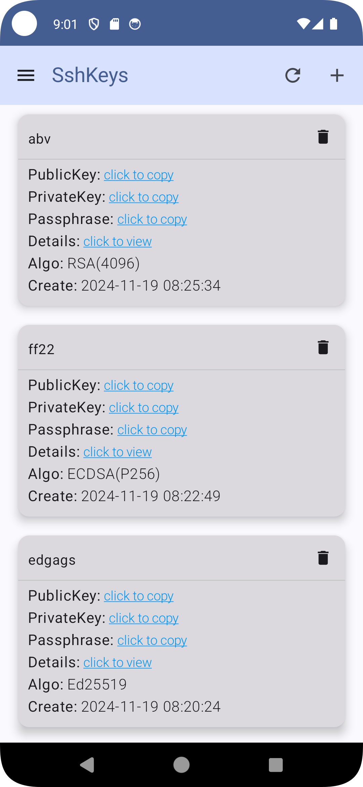
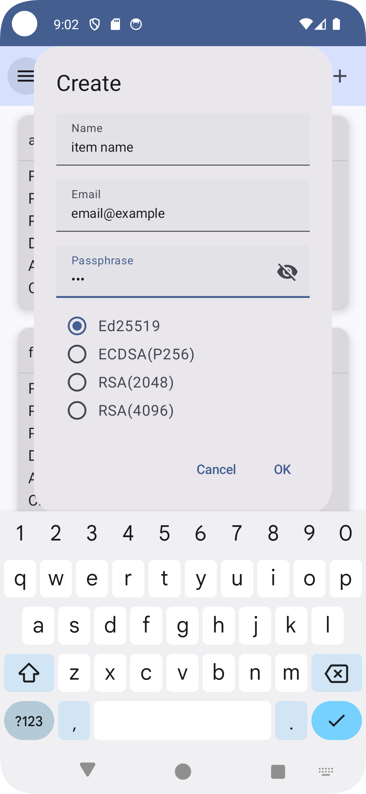
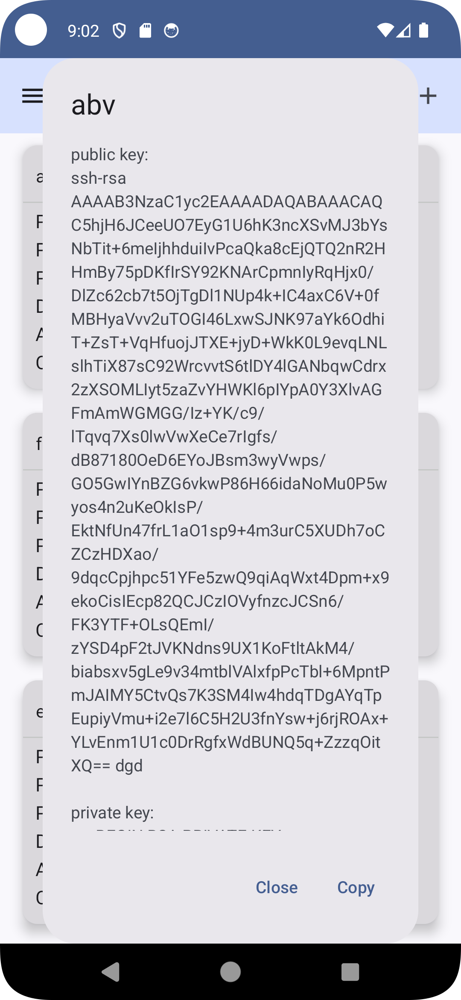

# SshKeyMan
Generate/Manage your ssh keys on Android devices

feature:
generate ed25519/ecdsa(p256)/rsa(2048, 4096) ssh keys

## Author
SshKeyMan made by Bandeapart1964 of catpuppyapp

### SshKeyMan is a free app, but if it helpful to you, please consider Star + <a href=https://github.com/catpuppyapp/PuppyGit/blob/main/donate.md>Donate</a>, it will help this project long live.

## Download

## Screenshot

